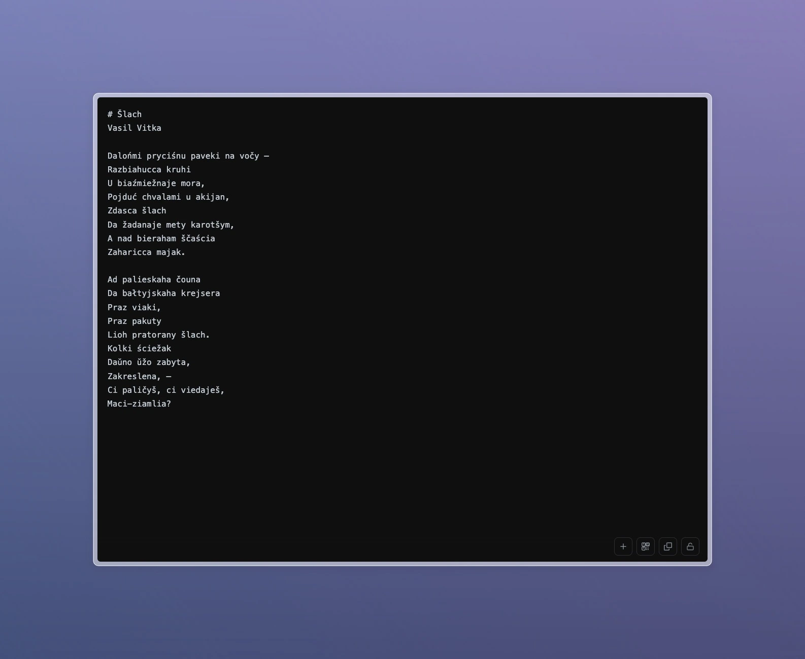

# Runic Notes ✎

A minimal, privacy-focused text editor that lives in the URL. No server, no database — your notes are stored directly in the link.



## Features

### Core
- **URL Storage** — Notes are compressed and stored in the URL hash
- **Local Storage** — Large notes automatically saved to IndexedDB
- **Encryption** — AES-GCM encryption with password protection
- **QR Codes** — Share notes via scannable QR codes

### Sharing
- **Copy URL** — One-click copy shareable link (⌘/Ctrl+Shift+C)
- **Web Share** — Native sharing on mobile devices
- **Download** — Export notes as .txt files (⌘/Ctrl+S)
- **Drag & Drop** — Import .txt files by dropping

## Keyboard Shortcuts

| Shortcut | Action |
|----------|--------|
| `⌘/Ctrl + N` | New note |
| `⌘/Ctrl + S` | Download as .txt |
| `⌘/Ctrl + Shift + C` | Copy URL |
| `Escape` | Close modal |

## Privacy & Security

- **Zero Server** — No data ever leaves your browser
- **End-to-End Encryption** — AES-256-GCM with PBKDF2 key derivation
- **No Tracking** — No analytics, no cookies, no telemetry
- **Open Source** — Fully auditable code

## How It Works

1. **Small notes** (< 2KB compressed) are stored entirely in the URL hash
2. **Large notes** are saved to IndexedDB with a short reference ID in the URL
3. **Encrypted notes** use the `#!` prefix and require a password to decrypt

## Tech Stack

- Vanilla JavaScript (no dependencies)
- LZW compression for URL storage
- Web Crypto API for encryption
- IndexedDB for local storage

## Browser Support

Works in all modern browsers:
- Chrome/Edge 79+
- Firefox 51+
- Safari 10+
- Opera (except Mini)

## Installation

### Self-hosted
```bash
git clone https://github.com/undefined-art/runic-notes.git
cd runic-notes
python -m http.server 8000
```

## Useful commands

```bash
# Check file sizes after minification
ls -lh index.html index.min.html

# Check gzipped size
gzip -c index.min.html | wc -c

# Minify and check size
npx html-minifier --collapse-whitespace --remove-comments --minify-css true --minify-js true index.html -o index.min.html && ls -lh index.min.html
```

---

Built because sometimes you just want to share text without creating an account.
