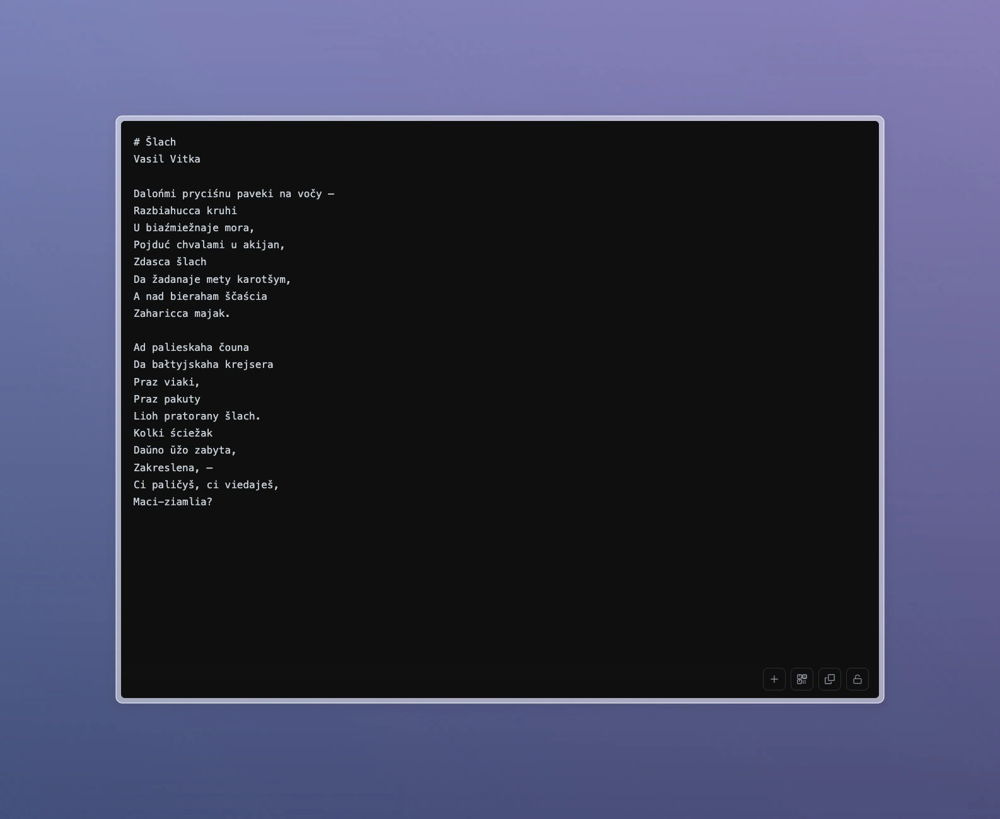

# Runic Notes

Runic Notes is a minimal text editor that keeps your notes inside the browser and lets you share them with a single link.

The idea is simple. You write text, the app encodes it into the URL, and you can send that link to someone else. They open it and see the same note without accounts or servers.



## How it works

### Small notes are stored directly in the URL.

If the compressed text is under about 2KB, the entire note lives in the URL hash. The browser reads it and restores the content instantly. For example, a short message or checklist can be shared as one link and opened on any device.

### Larger notes are saved locally.

When the text grows beyond the limit, the editor stores it in IndexedDB on your device. The URL then contains a short reference ID instead of the full content. This keeps the app fast and avoids URL size limits. Keep in mind that such links only work on the same device.

### Encrypted notes stay private.

You can protect a note with a password. The app uses AES-256-GCM and derives the key with PBKDF2. The decryption happens locally in the browser. For example, you can send a link and share the password separately.

## Features

- You can store short notes directly inside the URL and share them instantly.  
- You can save large notes locally using IndexedDB on your device.  
- You can protect notes with a password using modern browser encryption.  
- You can generate a QR code and open the note on another device.  
- You can copy a shareable link with a keyboard shortcut.  
- You can download notes as `.txt` files.  
- You can import `.txt` files with drag and drop.  

## Keyboard shortcuts

- `Ctrl / Cmd + N` creates a new note.  
- `Ctrl / Cmd + S` downloads the note as a `.txt` file.  
- `Ctrl / Cmd + Shift + C` copies the note URL.  
- `Escape` closes active dialogs.  

## Privacy

Your data stays in your browser.

The app does not send your notes to any server while you write or read them. There are no trackers, analytics scripts, cookies, or telemetry. The code is open source, so you can verify how everything works.

## Tech stack

- Vanilla JavaScript with no external dependencies.  
- LZW compression for fitting text into URLs.  
- Web Crypto API for encryption and decryption.  
- IndexedDB for local storage.  

## Local setup

Clone the repository and run a simple server.

```bash
git clone https://github.com/undefined-art/runic-notes.git
cd runic-notes
python -m http.server 8000
```